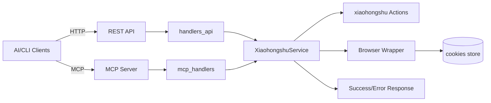
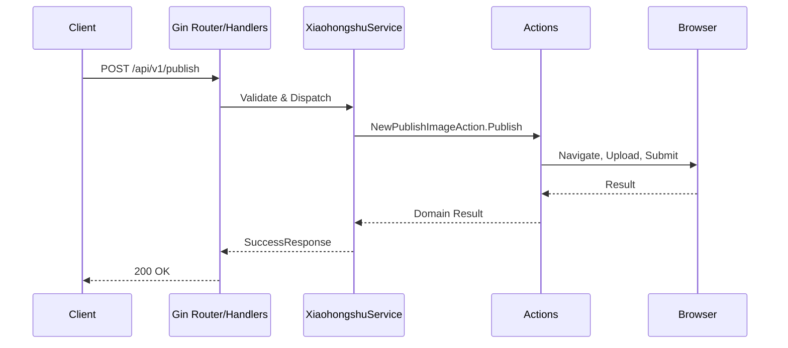

# 架构设计与数据流

- 整体架构：HTTP(REST) + MCP(Streamable HTTP)
- 关键组件：`AppServer`、`XiaohongshuService`、`MCP Server`、`handlers`、`routes`、`configs`、`browser`、`xiaohongshu/*`

## 1. 组件关系（Mermaid）

## 2. 请求生命周期（Sequence）

## 3. 错误与日志

- 统一响应：`SuccessResponse` / `ErrorResponse`
- 日志分层：入口、服务、动作层关键字段（方法、路径、账号、耗时、错误详情）

## 4. 会话与状态

- 会话持久：`./data` cookies 存储，首次登录后自动加载
- 浏览器封装：`browser.NewBrowser` 管理实例、语言/字体设置、下载目录

## 5. 依赖关系与扩展

- Service 依赖 Actions 与 Browser；Handlers/MCPHandlers 依赖 Service
- 新增能力时保持分层：入口 -> 处理器 -> 服务 -> 动作 -> 浏览器/外部
