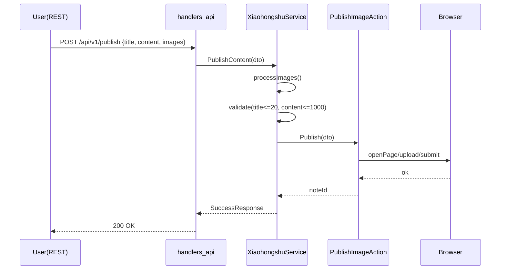

# 代码走读（关键路径）

## 1. 启动链路
`main.go` → `NewXiaohongshuService` → `NewAppServer` → `Start()` → `setupRoutes`

- `NewXiaohongshuService`：初始化浏览器、cookie 存储、站点动作
- `NewAppServer`：注册 REST 路由与 MCP 服务器
- `setupRoutes`：`/api/v1/*` HTTP 端点

## 2. 发布图文（REST）
入口：`POST /api/v1/publish`

调用链：
- `handlers_api.publishHandler`
- `service.PublishContent`
- `processImages`（本地/HTTP 图片处理）
- `publishContent`（参数校验、标题/正文长度检查）
- `xiaohongshu.NewPublishImageAction().Publish`

## 3. 发布（MCP 工具）
入口：`publish_content`
- `mcp_server.registerTools` → `mcp_handlers.handlePublishContent` → `service.PublishContent`
- 返回：`mcp.CallToolResult`，与 REST 响应契约对齐

## 4. 搜索与详情
- `SearchFeeds(keyword)`：返回 feeds 与 `xsec_token`
- `GetFeedDetail(feedId, xsec_token)`：返回互动数据与评论列表

## 5. 点赞/收藏/评论
- 动作封装在 `xiaohongshu/*`，统一浏览器与重试策略

阅读要点：统一响应结构、错误处理、日志打点、参数校验、标题宽度校验、图片处理策略。