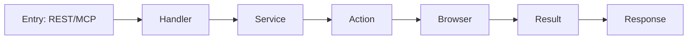

# 扩展与二次开发

## 1. 新增 REST 端点
- 在 `routes.go` 注册路径 → `handlers_api.go` 新增 handler → `service.go` 增加业务方法
- 契约：入参/出参统一使用 `SuccessResponse`/`ErrorResponse`

## 2. 新增 MCP 工具
- `mcp_server.go` 中注册工具元信息
- `mcp_handlers.go` 中实现具体 `handleXXX`
- 返回 `mcp.CallToolResult`，字段与 REST 响应对齐

## 3. 新增站点动作（Action）
- 在 `xiaohongshu/*` 新增动作目录与 `Action` 结构
- 复用 `browser` 封装进行页面导航、上传、提交等步骤

## 4. 依赖注入与配置
- 通过 `NewXiaohongshuService` 注入浏览器与配置
- 配置项位于 `configs/*`，按需增加开关（如是否自动重试）

## 5. 发布前检查清单
- 参数校验完整（标题/正文/图片/视频）
- 错误处理统一，返回明确的错误码与描述
- 日志包含关键字段，便于定位问题
- 增加最小示例与 curl/MCP Inspector 验证步骤

## 6. 示例模板（Mermaid 流程模板）
